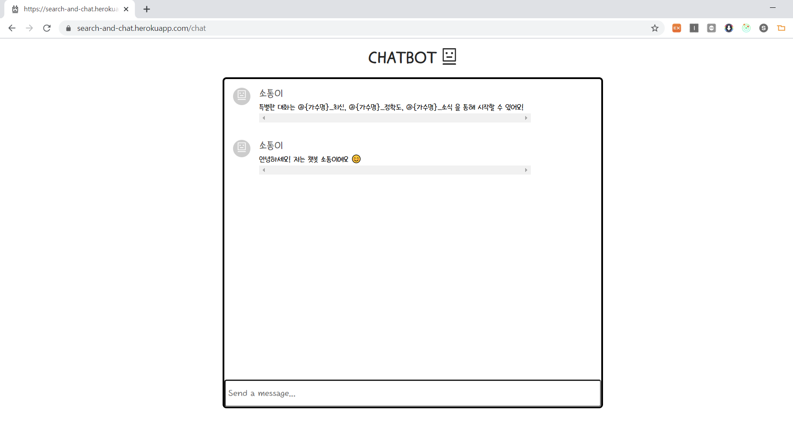

README referred to [Github](https://github.com/othneildrew/Best-README-Template)


<!-- PROJECT LOGO -->
<br />
<p align="center">
  <h3 align="center">SEARCH AND CHAT</h3>

  <p align="center">
    웹 페이지로 구현된 챗봇과 대화 및 '@'를 이용하여 최신 영상, 정확도 높은 영상, 소식을 카드로 제공합니다.
  "http://khuhub.khu.ac.kr/2017103084/oss-chatbot"
  <a href="http://khuhub.khu.ac.kr/2017103084/oss-chatbot/">View Demo</a>
  ·
  <a href="http://khuhub.khu.ac.kr/2017103084/oss-chatbot/issues">Report Bug</a>
  ·
  <a href="http://khuhub.khu.ac.kr/2017103084/oss-chatbot/merge_requests">Request Feature</a>
  </p>
</p>


<!-- TABLE OF CONTENTS -->
## Table of Contents

* [About the Project](#about-the-project)
  * [Built With](#built-with)
* [Getting Started](#getting-started)
  * [Prerequisites](#prerequisites)
  * [Installation](#installation)
* [Usage](#usage)
* [Roadmap](#roadmap)
* [Contributing](#contributing)
* [License](#license)
* [Contact](#contact)
* [Acknowledgements](#acknowledgements)


<!-- ABOUT THE PROJECT -->
## About The Project

[

카카오톡, 라인 등에서 제공하는 챗봇 어플리케이션과 같이 웹에서도 작동할 수 있는 챗봇을 만들어, 웹 사용자들과 대화할 수 있는 봇을 만들고 싶어 이 프로젝트를 진행하게 되었습니다. 간단한 대화와 더불어 좋아하는 가수, 또는 배우 등의 이름과 함께 검색어를 입력하면 봇이 대신 정보를 가져와주는 편의성을 더하였습니다.


### Built With

* [Nodejs](https://nodejs.org/en/)
* [React](https://ko.reactjs.org/)
* [Google Cloud API](https://cloud.google.com/apis)
* [Dialogflow API](https://dialogflow.cloud.google.com/)


<!-- GETTING STARTED -->
## Getting Started

로컬 컴퓨터에서 실행시킬 수 있는 방법입니다.

### Prerequisites

먼저, 이 프로젝트를 실행시키기 위해 필요한 요구사항입니다.

* Node
[Official Node.js Website](https://nodejs.org/)에서 Node.js를 설치합니다.
또한 `npm` 의 설치도 필요합니다. 

### Installation
 
1. 이 리포지토리를 Clone 합니다.
```sh
git clone http://khuhub.khu.ac.kr/2017103084/oss-chatbot/
```
2. root 폴더와 client 폴더에서 아래 명령을 실행합니다.
```sh
npm install
```
3. [Google Developers](https://console.developers.google.com/project)에서 프로젝트를 생성한 뒤, API 키를 발급 받습니다. 이 때, 프로젝트 명(ID)과 API 키의 json 파일이 필요합니다.

4. [Dialogflow](https://dialogflow.cloud.google.com/)에서 에이전트를 생성합니다. 이 때, GOOGLE PROJECT 탭의 Project ID는 앞서 (3)에서 생성한 프로젝트의 ID를 선택합니다.

5. root 폴더에 .env 파일을 생성한 뒤, 아래 내용을 채워 넣습니다.
```
googleProjectID = (3)에서 생성한 구글 프로젝트 ID
dialogFlowSessionID = bot-session #원하는 것으로 입력.
dialogFlowSessionLanguageCode = Dialogflow 에이전트 생성 시 설정한 언어 코드 (ex. 한글일 경우에는 "ko" 입니다.)
googleClientEmail = 구글 프로젝트 생성 시 제공되는 이메일 (ex. [프로젝트 명]@[프로젝트명 2].iam.gserviceaccount.com)
```

6. **중요** 로컬에서 실행하는 경우에는 root의 package.json 중 "@google-cloud/storage": "^5.0.1" 를 지웁니다. 이 패키지는 herokuapp에서 GOOGLE_APPLICATION_CREDENTIALS를 활용하기 위해 설치되어있는 패키지입니다.

7. 모두 완료 되었다면, 아래 명령어를 입력하여 클라이언트와 서버를 모두 실행시킬 수 있습니다.
```
npm run dev
```


<!-- USAGE EXAMPLES -->
## Usage

해당 프로젝트의 실제 동작 화면은 [SEARCH-AND-CHAT](https://search-and-chat.herokuapp.com/)에서 확인하실 수 있습니다.
React 의 특성 상 뒤로가기 및 Reload 시 오류가 발생할 수 있습니다. 이 때는 아래 URL로 재접속하시면 원활히 사용하실 수 있습니다. 또한 heroku 로 빌드되어 사용이 없는 경우에는 첫 접속 시 로딩 시간이 걸릴 수 있습니다. 조금만 기다려주시면 프로젝트가 실행될 것입니다 😊

* URL : <https://search-and-chat.herokuapp.com/>


<!-- CONTRIBUTING -->
## Contributing

이 프로젝트를 더욱 발전시키고 싶으신 분들은 아래와 같은 절차를 따라주세요!

1. Fork the Project
2. Create your Feature Branch (`git checkout -b feature/AmazingFeature`)
3. Commit your Changes (`git commit -m 'Add some AmazingFeature'`)
4. Push to the Branch (`git push origin feature/AmazingFeature`)
5. Open a Pull Request

<!-- CONTACT -->
## Contact

프로젝트에 문제가 있거나 궁금하신 사항은 아래 메일로 연락주세요.
* Email : <mathmjseo@khu.ac.kr>

